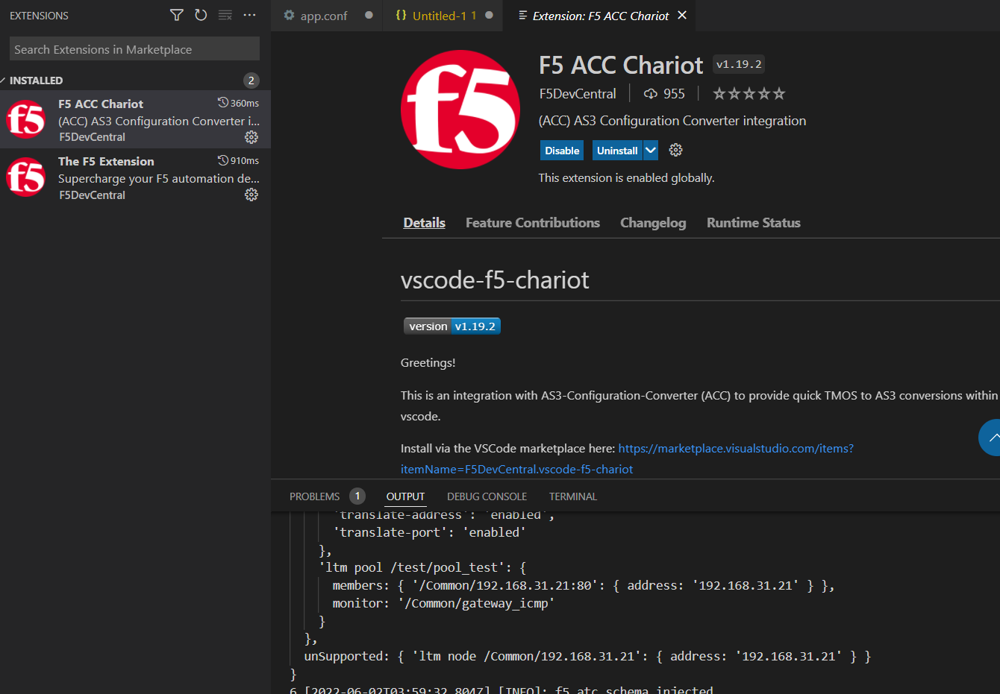
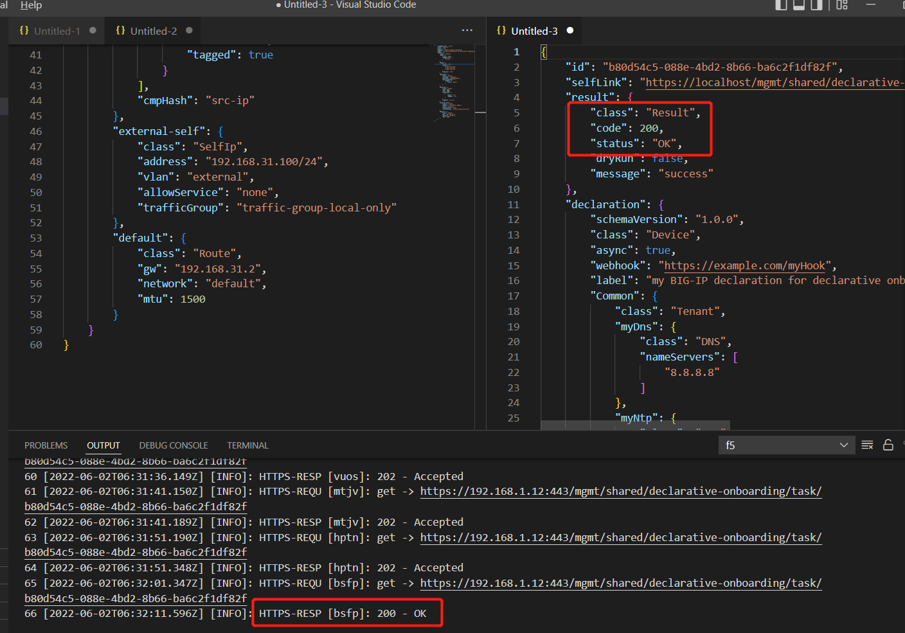

# 环境介绍和部署

• Bigip VE：14.1.4.4

• AS3版本：3.33.0

• VSCode版本：1.67.2

# 1. 安装环境

1）VSCode下载并安装
https://code.visualstudio.com/

2）安装F5插件

3)F5安装AS3和DO

# 2.F5 ACC Chariot 转换实验

1）连接F5

连接成功后可以看到对应信息

2）导入UCS

3）ACC转换为AS3

右击选择convert to AS3 with ACC 

进入ACC Chariot查看转换输出信息

4）用AS3格式下发应用至F5

error报错：需修改schemaVersion

应用下发成功！

# 3.DO配置实验 

下载链接 https://github.com/F5Networks/f5-declarative-onboarding/releases

推送DO配置

200 ok 推送成功！

查看VE上的配置
